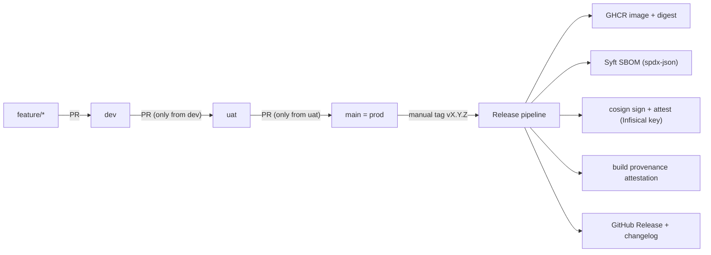

# CI/CD Improvement Plan — portfolio-secure-cicd

This plan is written to be executed by a separate agent running in the `sauravrana646/portfolio-secure-cicd` repository (the demo repo), followed by a final step in this `devops-portfolio` website repo.

## Context (current state)

Repo `sauravrana646/portfolio-secure-cicd` today:
- Branches: `main`, `demo/fail-critical`.
- One workflow `.github/workflows/ci.yml`: `test` (pytest) then `security` (Trivy fs CRITICAL gate, Trivy image CRITICAL gate, SARIF uploads, Syft SPDX SBOM artifact). Triggers on push to `main` and all PRs.
- Python app (`app/main.py`, gunicorn), `Dockerfile` (+ `Dockerfile.vulnerable`), `docs/CASE_STUDY.md`, `README.md` (mermaid architecture), `policies/`, `trivy.yaml`, `.trivyignore`.

Signing reference (user-provided `learning-actions/.github/workflows/merge-and-push.yaml`): GHCR login with `GITHUB_TOKEN`; build/push via `docker/build-push-action`; `sigstore/cosign-installer`; fetch cosign key material from Infisical via `Infisical/secrets-action@v1.0.9` (OIDC, `project-slug: homelab-sq-te`, `secret-path: /cosign`, keys `cosign-private-key`, `cosign-public-key`, `cosign-key-password`); `cosign sign/verify/attest --key env://...`.

## Target promotion model

- `main` is the prod branch. There is no separate `prod` branch; release tags are cut from `main`.
- `feature/*` → PR → `dev` (any source branch allowed).
- `dev` → PR → `uat` (source must be `dev`).
- `uat` → PR → `main` (source must be `uat`).
- CI quality gates run on PRs into `dev`/`uat`/`main` and on push to those branches.
- Release is triggered only by a manually pushed semver tag `vX.Y.Z` on `main` (created after the `uat`→`main` merge).

Note: GitHub branch protection cannot natively restrict "which source branch may merge into a target". This is enforced by an in-repo promotion-guard workflow (checks `github.head_ref`) plus branch-protection/ruleset settings applied in repo settings.

## Step 1 — Create long-lived branches

- Create `dev` and `uat` from current `main`. `main` stays as the default branch and serves as prod (do NOT create a separate `prod` branch).
- Keep `demo/fail-critical` for the existing sales gate-fail demo.

## Step 2 — Quality-gate CI on every environment branch

Modify `.github/workflows/ci.yml` triggers so gates run on the promotion branches:
- `on.pull_request.branches: [dev, uat, main]`
- `on.push.branches: [dev, uat, main]`

Keep the existing `test` + `security` jobs (Trivy fs/image CRITICAL gates, SARIF, Syft SBOM) as the shared quality gate. Optionally factor the gate into a reusable workflow (`workflow_call`) so `ci.yml` and `release.yml` share it. This is the required status check for all three branches.

## Step 3 — Promotion guard workflow

New `.github/workflows/promotion-guard.yml`, triggered on `pull_request` with `branches: [uat, main]`:
- If base is `uat`, fail unless `github.head_ref == 'dev'`.
- If base is `main`, fail unless `github.head_ref == 'uat'`.
- Emit a clear error (e.g. "uat only accepts merges from dev"; "main (prod) only accepts merges from uat").

This becomes a required status check on `uat` and `main` so mis-sourced PRs cannot merge.

## Step 4 — Branch protection / rulesets (repo settings)

Apply via `gh api`/rulesets (documented in the PR body; executor runs these or hands to the user, since they are settings, not committed files):
- `dev`: require PR, require `ci` checks green, no direct pushes.
- `uat`: require PR, require `ci` + `promotion-guard` green, require up-to-date, linear history.
- `main` (prod): same as `uat` plus optional required reviews / environment protection.
- Restrict tag creation to maintainers for `v*` (tag protection) so releases are deliberate.

## Step 5 — Release pipeline (manual semver tag)

New `.github/workflows/release.yml`, triggered `on.push.tags: ['v*.*.*']`, permissions `id-token: write`, `contents: write`, `packages: write`, `attestations: write`. Jobs:

1. Re-run the shared quality gate (reusable `ci`) to ensure the tagged commit passes.
2. Build + push image to GHCR (tag vs digest):
   - Login: `docker/login-action` (`ghcr.io`, `github.actor`, `GITHUB_TOKEN`).
   - Build once and push these human tags to the same image: `ghcr.io/${{ github.repository }}:${{ github.ref_name }}` (the `vX.Y.Z` release tag) and `:${{ github.sha }}` (commit traceability); `:latest` optional.
   - Capture the immutable digest `steps.build.outputs.digest` (`sha256:...`). The digest — not the tag — is the canonical image identity.
   - Define `IMAGE_REF=ghcr.io/${{ github.repository }}@${{ steps.build.outputs.digest }}` and use `IMAGE_REF` for ALL cosign sign/verify/attest and provenance steps (signing a mutable tag is unsafe).
   - Consumers pull by `:vX.Y.Z`; integrity is verified against the digest. Record the `vX.Y.Z` -> `sha256:...` mapping in the GitHub Release notes and recommend deploying pinned by digest (`:vX.Y.Z@sha256:...`).
3. SBOM (Syft, per preference): `anchore/sbom-action` against the pushed digest → `sbom.spdx.json` (keep existing Syft usage rather than Trivy SBOM).
4. Sign + attest with cosign private key from Infisical (adapt user's reference):
   - `sigstore/cosign-installer`.
   - `Infisical/secrets-action@v1.0.9` (OIDC; `identity-id`, `project-slug: homelab-sq-te`, `env-slug` per environment, `secret-path: /cosign`).
   - `export COSIGN_PASSWORD="$(printenv cosign-key-password)"`.
   - `cosign sign --yes --key env://cosign-private-key "$IMAGE_REF"` (IMAGE_REF = `ghcr.io/${{ github.repository }}@${digest}`).
   - `cosign verify --key env://cosign-public-key "$IMAGE_REF"`.
   - `cosign attest --yes --key env://cosign-private-key --type spdx --predicate sbom.spdx.json "$IMAGE_REF"`.
5. Build provenance attestation (SLSA): `actions/attest-build-provenance` with `subject-digest` = image digest (complements cosign attest).
6. Changelog + GitHub Release:
   - Generate changelog (recommend `orhun/git-cliff-action` or `mikepenz/release-changelog-builder-action`) from tags/commits.
   - Create the release with `softprops/action-gh-release`, attaching `sbom.spdx.json` and referencing image digest, signature, and attestations in the body.

## Step 6 — Prerequisites and secrets (document in PR)

- Infisical project `homelab-sq-te` with `/cosign` secrets: `cosign-private-key`, `cosign-public-key`, `cosign-key-password`; and a machine identity whose `identity-id` is set in the workflow (or as a repo variable). Confirm the correct `env-slug`.
- GHCR: ensure `packages: write` and that the package is linked to the repo (public if the demo should be pullable).
- Optional: pin all third-party actions to commit SHAs to match repo hardening ethos.

## Step 7 — Update demo-repo docs

- `README.md`: replace the single-PR mermaid with the dev→uat→main(prod)→tag→sign/attest flow; add a "Promotion & release" section; add release/signing badges.
- `docs/CASE_STUDY.md`: add promotion-gates + signed-release narrative (cosign private key via Infisical OIDC, SBOM attestation, provenance, changelog).
- `policies/security-gates.md`: document the per-branch gates and the promotion-guard rule.

## Step 8 — Update the portfolio website case study (this repo)

In `devops-portfolio` after the demo repo is done, update the `supply-chain-cicd-hardening` story to match:
- `content/projects.ts`: update `architecture`, `implementation`, `stack` (add `Cosign`, `GHCR`, `Infisical`, `SBOM attestation`, `SLSA provenance`), `outcomes`, and possibly `summary`/`metric` to describe the dev/uat/prod promotion + signed release.
- `content/architecture.ts`: revise the `signed-supply-chain` diagram `pattern`/`summary`/`legend`/`caption` to reflect promotion gates → tag → cosign sign/attest → provenance.
- `components/architecture/diagrams.tsx`: update the hand-authored `signed-supply-chain` static SVG to show the new stages.
- Validate locally (in `devops-portfolio`): `npm run lint`, `npm run typecheck`, `npm run test`, `npm run build`.

## Validation

- Demo repo: open a `feature/*`→`dev` PR (gates run); a `dev`→`uat` PR (guard passes) and a bad `feature`→`uat` PR (guard fails); a `uat`→`main` PR (guard passes) and a bad `dev`→`main` PR (guard fails); then push tag `v0.1.0` on `main` and confirm the release job pushes to GHCR, produces the SBOM, `cosign verify` succeeds, attestations exist (`cosign verify-attestation` / `gh attestation verify`), and a GitHub Release with changelog is created.
- Website: build passes and the case study renders the new flow.

## Assumptions / open items

- Cosign key material lives in Infisical at `/cosign` with the three key names above; the machine `identity-id` and `env-slug` will be supplied by the user or read from repo variables.
- Semver bump is manual (user pushes the tag); changelog is generated from commit history (Conventional Commits recommended but not required).
- `dev`/`uat`/`main`(prod) are promotion/quality gates only (no real cloud deploy), consistent with the repo's local-first, OIDC-stub-disabled stance.
- Applying branch-protection/rulesets and tag protection are repo-settings actions (via `gh api`/UI), listed for the executor/user to apply.
